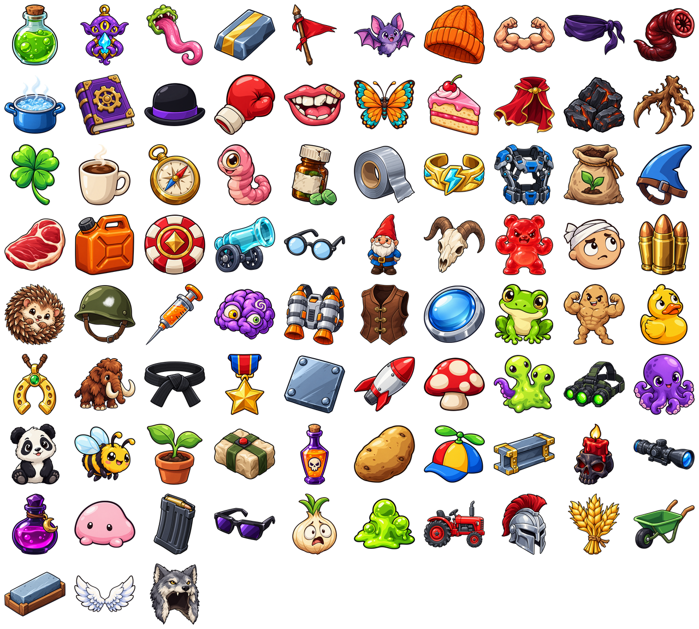

# Items

The game registers **83 stat items** in [Items.ts](../src/items/Items.ts): 33 tier I, 24 tier II, 14 tier III, and 12 tier IV. Each definition supplies a stable ID, localized name key, tier, base price, and additive stat bonuses. Names below use the [English locale](../src/i18n/locales/en.ts); the UI resolves `nameKey` in the selected language.

See [Game Balance](../../docs/balance.md) for the economy, weapon scaling, and character implications, and [Weapons](weapons.md) for damage scaling and explosive attacks.

## Item values

These are per-copy bonuses before character stats, other items, upgrades, and combat caps. Positive and negative bonuses both stack. Percentage values are additive percentage points, not successive multipliers; Speed and Pickup Range apply the summed percentage to their base values. Luck follows the UI's percentage notation. HP Regeneration is a stat used by the regeneration formula, not HP per second. Range and Knockback are flat stat points.

Base price is the input to the shop formula, **not the displayed wave-1 price**. The frame column gives the top-left `x, y` pixel coordinates in the sprite atlas; every frame is 128 × 128 pixels. Item names link to their individual PNG artwork.

### Tier I

| Item | ID | Base price | Stat bonuses | Frame (x, y) |
| --- | --- | --- | --- | --- |
| [Alien Tongue](../src/assets/items/alienTongue.png) | `alienTongue` | 25 | +30% Pickup Range; +1 Knockback | 256, 0 |
| [Bat](../src/assets/items/bat.png) | `bat` | 20 | +2% Life Steal; −2 Harvesting | 640, 0 |
| [Beanie](../src/assets/items/beanie.png) | `beanie` | 20 | +4% Speed; −6 Range | 768, 0 |
| [Boiling Water](../src/assets/items/boilingWater.png) | `boilingWater` | 30 | +2 Elemental Damage; −1 Max HP | 0, 128 |
| [Book](../src/assets/items/book.png) | `book` | 15 | +2 Engineering; +1 Elemental Damage; −1% Luck | 128, 128 |
| [Boxing Glove](../src/assets/items/boxingGlove.png) | `boxingGlove` | 18 | +1 Melee Damage; +3 Knockback | 384, 128 |
| [Broken Mouth](../src/assets/items/brokenMouth.png) | `brokenMouth` | 25 | +5 Max HP; −1 HP Regeneration | 512, 128 |
| [Butterfly](../src/assets/items/butterfly.png) | `butterfly` | 30 | +2% Life Steal; −1 Elemental Damage | 640, 128 |
| [Cake](../src/assets/items/cake.png) | `cake` | 15 | +3 Max HP; −1% Damage | 768, 128 |
| [Charcoal](../src/assets/items/charcoal.png) | `charcoal` | 20 | +1 Elemental Damage; +2 Melee Damage; −2 Harvesting | 1024, 128 |
| [Claw Tree](../src/assets/items/clawTree.png) | `clawTree` | 20 | +1 Melee Damage; +3% Critical Chance; −1 Max HP | 1152, 128 |
| [Coffee](../src/assets/items/coffee.png) | `coffee` | 20 | +10% Attack Speed; −2% Damage | 128, 256 |
| [Defective Steroids](../src/assets/items/defectiveSteroids.png) | `defectiveSteroids` | 20 | +2 Max HP; +2 Melee Damage; −3% Attack Speed | 512, 256 |
| [Duct Tape](../src/assets/items/ductTape.png) | `ductTape` | 20 | +1 Armor; +1 Engineering; −2 Max HP | 640, 256 |
| [Fertilizer](../src/assets/items/fertilizer.png) | `fertilizer` | 15 | +8 Harvesting; −1 Melee Damage | 1024, 256 |
| [Fresh Meat](../src/assets/items/freshMeat.png) | `freshMeat` | 25 | +2% Life Steal; −1 HP Regeneration | 0, 384 |
| [Glasses](../src/assets/items/glasses.png) | `glasses` | 20 | +20 Range | 512, 384 |
| [Goat Skull](../src/assets/items/goatSkull.png) | `goatSkull` | 25 | +3 Melee Damage; −2% Critical Chance | 768, 384 |
| [Gummy Berserker](../src/assets/items/gummyBerserker.png) | `gummyBerserker` | 25 | +5% Attack Speed; +25 Range; −1 Armor | 896, 384 |
| [Head Injury](../src/assets/items/headInjury.png) | `headInjury` | 25 | +6% Damage; −8 Range | 1024, 384 |
| [Hedgehog](../src/assets/items/hedgehog.png) | `hedgehog` | 30 | +2 Melee Damage; +1 Ranged Damage; −1 HP Regeneration | 0, 512 |
| [Helmet](../src/assets/items/helmet.png) | `helmet` | 15 | +1 Armor; −2% Speed | 128, 512 |
| [Injection](../src/assets/items/injection.png) | `injection` | 20 | +7% Damage; −2 Max HP | 256, 512 |
| [Insanity](../src/assets/items/insanity.png) | `insanity` | 20 | +6% Critical Chance; −3% Damage | 384, 512 |
| [Lens](../src/assets/items/lens.png) | `lens` | 20 | +1 Ranged Damage; −5 Range | 768, 512 |
| [Lost Duck](../src/assets/items/lostDuck.png) | `lostDuck` | 25 | +8% Luck; −1 Elemental Damage | 1152, 512 |
| [Mushroom](../src/assets/items/mushroom.png) | `mushroom` | 25 | +3 HP Regeneration; −2% Luck | 768, 640 |
| [Mutation](../src/assets/items/mutation.png) | `mutation` | 25 | +1 Ranged Damage; +1 Elemental Damage; −3 Knockback | 896, 640 |
| [Peaceful Bee](../src/assets/items/peacefulBee.png) | `peacefulBee` | 18 | +4% Dodge; +4 Harvesting; −1 Melee Damage; −1 Ranged Damage | 128, 768 |
| [Plant](../src/assets/items/plant.png) | `plant` | 15 | +3 HP Regeneration; −1% Life Steal | 256, 768 |
| [Propeller Hat](../src/assets/items/propellerHat.png) | `propellerHat` | 28 | +10% Luck; −2% Damage | 768, 768 |
| [Terrified Onion](../src/assets/items/terrifiedOnion.png) | `terrifiedOnion` | 15 | +4% Speed; −5% Luck | 512, 896 |
| [Toxic Sludge](../src/assets/items/toxicSludge.png) | `toxicSludge` | 20 | +2 Elemental Damage; −2% Dodge | 640, 896 |

### Tier II

| Item | ID | Base price | Stat bonuses | Frame (x, y) |
| --- | --- | --- | --- | --- |
| [Acid](../src/assets/items/acid.png) | `acid` | 65 | +8 Max HP; −2% Dodge; −2 Knockback | 0, 0 |
| [Banner](../src/assets/items/banner.png) | `banner` | 55 | +20 Range; +10% Attack Speed; −5 Knockback | 512, 0 |
| [Blindfold](../src/assets/items/blindfold.png) | `blindfold` | 45 | +5% Critical Chance; +5% Dodge; −15 Range | 1024, 0 |
| [Blood Leech](../src/assets/items/bloodLeech.png) | `bloodLeech` | 45 | +2% Life Steal; +2 HP Regeneration; −3 Harvesting | 1152, 0 |
| [Compass](../src/assets/items/compass.png) | `compass` | 40 | +5% Speed; +3 Engineering; −3% Critical Chance | 256, 256 |
| [Cyclops Worm](../src/assets/items/cyclopsWorm.png) | `cyclopsWorm` | 45 | +12% Damage; −12 Range | 384, 256 |
| [Energy Bracelet](../src/assets/items/energyBracelet.png) | `energyBracelet` | 55 | +4% Critical Chance; +2 Elemental Damage; −2 Ranged Damage | 768, 256 |
| [Fuel Tank](../src/assets/items/fuelTank.png) | `fuelTank` | 45 | +4 Elemental Damage; −1 Melee Damage; −1 Ranged Damage | 128, 384 |
| [Gambling Token](../src/assets/items/gamblingToken.png) | `gamblingToken` | 50 | +8% Dodge; −1 Armor | 256, 384 |
| [Leather Vest](../src/assets/items/leatherVest.png) | `leatherVest` | 45 | +2 Armor; +6% Dodge; −3 Max HP | 640, 512 |
| [Little Frog](../src/assets/items/littleFrog.png) | `littleFrog` | 45 | +20% Pickup Range; +10 Harvesting; −3% Dodge | 896, 512 |
| [Little Muscley Dude](../src/assets/items/littleMuscleyDude.png) | `littleMuscleyDude` | 50 | +3 Melee Damage; +5 Max HP; −15 Range | 1024, 512 |
| [Mastery](../src/assets/items/mastery.png) | `mastery` | 55 | +6 Melee Damage; −3 Ranged Damage | 256, 640 |
| [Medal](../src/assets/items/medal.png) | `medal` | 55 | +3 Max HP; +3% Damage; +1 Armor; +3% Speed; −4% Critical Chance | 384, 640 |
| [Metal Plate](../src/assets/items/metalPlate.png) | `metalPlate` | 40 | +2 Armor; −3% Damage | 512, 640 |
| [Missile](../src/assets/items/missile.png) | `missile` | 45 | +10% Damage; −4% Attack Speed | 640, 640 |
| [Reinforced Steel](../src/assets/items/reinforcedSteel.png) | `reinforcedSteel` | 50 | +2 Ranged Damage; +3 Engineering; −3% Speed | 896, 768 |
| [Ritual](../src/assets/items/ritual.png) | `ritual` | 60 | +6% Damage; +2% Life Steal; −2 Engineering | 1024, 768 |
| [Scope](../src/assets/items/scope.png) | `scope` | 48 | +2 Ranged Damage; +25 Range; −7% Attack Speed | 1152, 768 |
| [Shady Potion](../src/assets/items/shadyPotion.png) | `shadyPotion` | 48 | +20% Luck; −2 HP Regeneration | 0, 896 |
| [Small Magazine](../src/assets/items/smallMagazine.png) | `smallMagazine` | 60 | +2 Ranged Damage; +10% Attack Speed; −6% Damage | 256, 896 |
| [Sunglasses](../src/assets/items/sunglasses.png) | `sunglasses` | 50 | +10% Critical Chance; −1 Armor | 384, 896 |
| [Wheelbarrow](../src/assets/items/wheelbarrow.png) | `wheelbarrow` | 40 | +16 Harvesting; −1 Armor | 1152, 896 |
| [Whetstone](../src/assets/items/whetstone.png) | `whetstone` | 40 | +4% Life Steal; −3 Knockback | 0, 1024 |

### Tier III

| Item | ID | Base price | Stat bonuses | Frame (x, y) |
| --- | --- | --- | --- | --- |
| [Alien Magic](../src/assets/items/alienMagic.png) | `alienMagic` | 85 | +8 Max HP; +3 HP Regeneration; −8% Luck | 128, 0 |
| [Alloy](../src/assets/items/alloy.png) | `alloy` | 80 | +3 Melee Damage; +3 Ranged Damage; +3 Elemental Damage; +3 Engineering; +5% Critical Chance; −6% Dodge | 384, 0 |
| [Bowler Hat](../src/assets/items/bowlerHat.png) | `bowlerHat` | 75 | +15% Luck; +18 Harvesting; −5% Attack Speed; −3% Critical Chance | 256, 128 |
| [Clover](../src/assets/items/clover.png) | `clover` | 65 | +20% Luck; +6% Dodge; −2% Life Steal | 0, 256 |
| [Fin](../src/assets/items/fin.png) | `fin` | 65 | +10% Speed; +3% Life Steal; −8% Luck | 1152, 256 |
| [Glass Cannon](../src/assets/items/glassCannon.png) | `glassCannon` | 75 | +25% Damage; −3 Armor | 384, 384 |
| [Lucky Charm](../src/assets/items/luckyCharm.png) | `luckyCharm` | 75 | +30% Luck; −2 Melee Damage; −1 Ranged Damage | 0, 640 |
| [Plastic Explosive](../src/assets/items/plasticExplosive.png) | `plasticExplosive` | 60 | +25% Explosion Size | 384, 768 |
| [Poisonous Tonic](../src/assets/items/poisonousTonic.png) | `poisonousTonic` | 80 | +10% Attack Speed; +5% Critical Chance; +15 Range; −2 HP Regeneration | 512, 768 |
| [Shmoop](../src/assets/items/shmoop.png) | `shmoop` | 60 | +6 Max HP; +2 HP Regeneration; −2 Melee Damage; −1 Ranged Damage | 128, 896 |
| [Tractor](../src/assets/items/tractor.png) | `tractor` | 70 | +40 Harvesting; −8% Damage | 768, 896 |
| [Warrior Helmet](../src/assets/items/warriorHelmet.png) | `warriorHelmet` | 80 | +3 Armor; +5 Max HP; −5% Speed | 896, 896 |
| [Wheat](../src/assets/items/wheat.png) | `wheat` | 85 | +4 Melee Damage; +2 Ranged Damage; +10 Harvesting; −2 Elemental Damage | 1024, 896 |
| [Wings](../src/assets/items/wings.png) | `wings` | 85 | +10% Speed; +30 Range; −2 Elemental Damage | 128, 1024 |

### Tier IV

| Item | ID | Base price | Stat bonuses | Frame (x, y) |
| --- | --- | --- | --- | --- |
| [Big Arms](../src/assets/items/bigArms.png) | `bigArms` | 105 | +12 Melee Damage; +6 Ranged Damage; +3 Knockback; −3% Attack Speed; −3% Speed | 896, 0 |
| [Cape](../src/assets/items/cape.png) | `cape` | 110 | +5% Life Steal; +20% Dodge; −2 Melee Damage; −2 Ranged Damage; −2 Elemental Damage | 896, 128 |
| [Exoskeleton](../src/assets/items/exoskeleton.png) | `exoskeleton` | 90 | +3 Armor; +5% Critical Chance; +5 Engineering; +5% Speed; −2 HP Regeneration; −2% Life Steal | 896, 256 |
| [Gnome](../src/assets/items/gnome.png) | `gnome` | 100 | +10 Melee Damage; +10 Elemental Damage; −20 Range; −20% Pickup Range | 640, 384 |
| [Heavy Bullets](../src/assets/items/heavyBullets.png) | `heavyBullets` | 100 | +5 Ranged Damage; +10% Damage; +10 Range; −5% Attack Speed; −5% Critical Chance | 1152, 384 |
| [Jet Pack](../src/assets/items/jetPack.png) | `jetPack` | 100 | +15% Speed; +10% Dodge; −5 Max HP; −1 Armor | 512, 512 |
| [Mammoth](../src/assets/items/mammoth.png) | `mammoth` | 110 | +20 Melee Damage; +5 HP Regeneration; +5 Knockback; −8% Damage; −3% Speed | 128, 640 |
| [Night Goggles](../src/assets/items/nightGoggles.png) | `nightGoggles` | 95 | +15% Critical Chance; +50 Range; −3 Max HP; −1 Armor | 1024, 640 |
| [Octopus](../src/assets/items/octopus.png) | `octopus` | 105 | +12 Max HP; +5 HP Regeneration; +3% Life Steal; −8% Critical Chance | 1152, 640 |
| [Panda](../src/assets/items/panda.png) | `panda` | 100 | +12 Max HP; +25% Luck; −5% Damage | 0, 768 |
| [Potato](../src/assets/items/potato.png) | `potato` | 95 | +3 Max HP; +2 HP Regeneration; +1% Life Steal; +5% Damage; +5% Attack Speed; +3% Speed; +3% Dodge; +1 Armor; +5% Luck | 640, 768 |
| [Wolf Helmet](../src/assets/items/wolfHelmet.png) | `wolfHelmet` | 90 | +10 Elemental Damage; +20% Luck; −5 Engineering | 256, 1024 |

## Shop selection and prices

[ShopItemsGenerator](../src/shop/ShopItemsGenerator.ts) fills four slots by default. Each slot offers a weapon with a 35% chance when both pools are available; otherwise it offers an item. All 83 items are available by default, independently of the character's weapon pool. Callers can supply a restricted item pool. An item appears at most once within a roll, but can appear again on later rolls even when already owned. If the rolled tier has no remaining items, selection falls back to any lower-tier item, then any remaining item.

`rollItemTier` uses [upgradeTierChance](../src/upgrades/Upgrades.ts) with the **wave** as its level argument. It tests IV, III, then II with separate random rolls; tier I is the fallback. Unlike level-up upgrades, shop items have no guaranteed tiers on milestone waves.

| Tier | Per-roll test probability | First possible wave (default pool) | Cap |
| --- | --- | --- | --- |
| IV | `min(0.08, max(0, wave − 6) × 0.0023 × L)` | 7 | 8% |
| III | `min(0.25, max(0, wave − 2) × 0.02 × L)` | 3 | 25% |
| II | `min(0.60, wave × 0.06 × L)` | 1 | 60% |
| I | Fallback when all higher-tier tests fail | 1 | — |

Here `L = max(0, 1 + luck / 100)`. These are conditional test probabilities: a tier III offer must first fail the tier IV test, for example. At wave 1 and zero luck, an item slot has a 6% chance of tier II and a 94% chance of tier I; tiers III and IV cannot appear from the default pool.

[`itemPrice`](../src/game-formulas.ts) computes:

`floor((basePrice + wave + basePrice × wave × 0.1) × inflation)`

Inflation defaults to 1. At wave 1, a base-price-15 Cake costs 17 materials, a base-price-30 Boiling Water costs 34, and a base-price-65 Acid costs 72. Tier IV's base prices of 90–110 would calculate to 100–122 at wave 1, but those items are not offered that early under the default tier rules. See the [economy review](../../docs/balance.md#1-materials-stop-mattering-after-about-wave-2) for the price gap between items and weapons.

## Ownership, stacking, and effects

A purchase appends an item ID to the explicit `items` list in [BulbroState](../src/bulbro/BulbroState.ts). The immutable `withItem(itemId)` method adds one copy and records a separate `kind: "item"` stat source with ID `item:<purchase index>:<item ID>`, then recomputes stats. It can also grant an item without spending materials; shop purchases validate the price and available materials before spending and adding the item. Unknown item IDs leave the state unchanged.

The list preserves acquisition order and duplicate copies, and is serialized alongside stat sources and computed stats. Older snapshots without `items` derive their initial list from item stat sources without reapplying bonuses. [computeStats](../src/game-formulas.ts) sums bonuses from all sources before applying them to base stats. Two Helmets give +2 Armor and −4% Speed. Max HP penalties clamp current health to the new maximum; Max HP bonuses do not heal. There is no per-item copy limit, and items do not occupy weapon slots.

[Shop](../src/shop/Shop.tsx) displays tier, localized name, artwork, per-copy bonuses, and the calculated price. Purchases depend on available materials and the shop's disabled state; reaching weapon capacity still allows item purchases. [ItemSlots](../src/shop/ItemSlots.tsx) groups identical owned items and displays their count alongside per-copy bonuses, rather than multiplying the displayed bonuses.

All current items are unconditional stat changes. Their names and artwork do not add attacks, summons, poison, burning, on-hit triggers, or other conditional effects. In particular:

- Engineering bonuses are stored but have no gameplay benefit while structures are absent. Pencil, Toolbox, and Cog are intentionally excluded because Engineering would be their only benefit. Book, Compass, Alloy, and other mixed-stat items remain available.
- Plastic Explosive adds +25% Explosion Size. Grenade and Bazooka use this to scale explosion radius; it does not make ordinary shots explode. A single copy changes their base radii from 110 to 137.5 and 140 to 175, respectively, before other bonuses.
- Flat Melee, Ranged, and Elemental Damage feed the weapon's scaling coefficients, followed by overall Damage and critical hits. They are not all added at full strength to every weapon. See the [weapon balance review](../../docs/balance.md#2-weapon-numbers-dont-fit-the-scaling-formulas).
- Dodge is capped at 60% in combat, attack cooldown has a 100 ms minimum, and maximum HP has a floor of 1. Additional item bonuses can therefore have diminishing or no benefit at a cap.

## Sprite atlas and tiles

[items.png](../src/assets/items.png) is a transparent **1280 × 1152** atlas with ten columns and nine rows. Its 83 frames are ordered by item ID; the final seven cells are empty. Each 128 × 128 cell contains artwork fitted within 112 × 112 pixels with at least eight transparent pixels on every side to avoid texture bleeding. Exact rectangles and sheet dimensions are stored in [items.json](../src/assets/items.json), independently of registry order.

[ItemDisplay](../src/items/ItemDisplay.tsx) crops the sheet using CSS background coordinates and scales the complete frame. Shop tiles use 48 × 48 pixels, owned-item tiles use 32 × 32, and the [Storybook gallery](../src/stories/Items.stories.tsx) uses 64 × 64. The sheet URL uses `new URL(..., import.meta.url)`, so Vite bundles a content-hashed asset; all tiles share the same image request. This DOM component needs no Pixi application or preload. Artwork is decorative because the adjacent tile text supplies the localized name. An unknown item ID renders no artwork.

Individual transparent 256 × 256 PNGs are retained in [assets/items](../src/assets/items) for reuse and repacking. The atlas is the only image consumed by the tile component. To rebuild it after adding or changing item artwork, run from `web/`:

`bun scripts/pack-items.ts`

The [packing script](../scripts/pack-items.ts) uses Bun and Sharp, reads the current registry, sorts IDs, fits the artwork, and writes both the PNG and frame manifest. Add a named source PNG for every new definition, regenerate the atlas, and update the tables here. The atlas tests check registry coverage, image dimensions, frame bounds, nonempty artwork, and transparent padding.

## Generation prompts

The 83 individual sprites were generated with the **built-in imagegen tool**, then resized and packed with Bun and Sharp while preserving alpha. These are custom Bulbro illustrations. The exact prompt for each item is recorded by ID in [item-image-prompts.json](item-image-prompts.json).

The shared art direction is a single centered inventory object on a genuinely transparent background, thick near-black outlines, colorful flat cel shading, restrained highlights, and a silhouette readable at 48 pixels. Prompts exclude labels, logos, backgrounds, borders, and cast shadows. Subjects distinguish similar items, such as the plain army Helmet, crested Warrior Helmet, and wolf-pelt Wolf Helmet.
